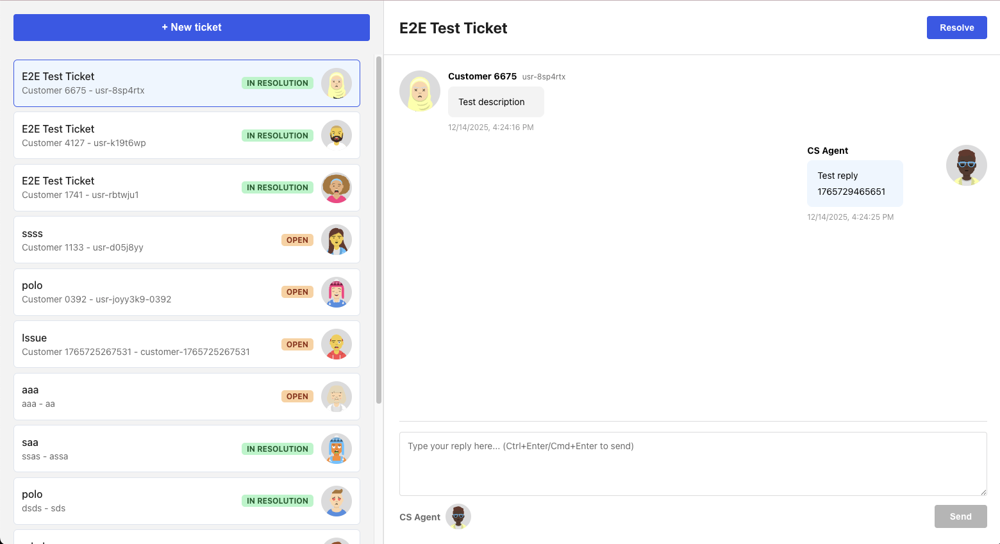

# Customer Support Ticketing System

> **A modern full-stack application for managing customer support tickets with real-time updates and seamless agent workflows**

## 📋 Project Overview

A comprehensive ticketing system built with cutting-edge technologies, designed to streamline customer support operations. Support agents can efficiently view, respond to, and manage customer inquiries with an intuitive interface and automatic status management.

**Technology Stack:**
- **Backend**: .NET 8 with Clean Architecture, Entity Framework Core, SQLite
- **Frontend**: React 19.2.3, TypeScript, Vite 7, React Query
- **Testing**: xUnit (backend), Vitest + Playwright (frontend)



---

## 🚀 Setup Instructions

### 📥 Download the Repository

Clone the repository using Git:

```bash
# Clone the repository
git clone https://github.com/xavimajoral/scopely.git
cd scopely
```

Or download the repository as a ZIP file from GitHub and extract it.

### 📋 Prerequisites

Before you begin, ensure you have the following installed:

- **.NET 8 SDK** - [Download here](https://dotnet.microsoft.com/download/dotnet/8.0)
    - Verify installation: `dotnet --version` (should show 8.x.x)
- **Node.js** (v18 or higher) - [Download here](https://nodejs.org/)
    - Verify installation: `node --version` (should show v18.x.x or higher)
- **pnpm** - [Install pnpm](https://pnpm.io/installation)
    - Install via npm: `npm install -g pnpm`
    - Verify installation: `pnpm --version`
- **SQLite** - Included with .NET (no separate installation needed)

### 🎯 Installation Steps

#### 1️⃣ Backend Installation

```bash
# Navigate to backend directory
cd backend

# Restore NuGet packages (downloads all dependencies)
dotnet restore

# Build the solution (compiles all projects)
dotnet build

# The database will be automatically created on first run
# Navigate to the API project and run it
cd SupportTicketingSystem.Api
dotnet run
```

**What happens:**
- `dotnet restore` - Downloads all NuGet packages (dependencies)
- `dotnet build` - Compiles the solution and all projects
- `dotnet run` - Starts the API server and creates the SQLite database automatically

**Backend will be available at:**
- 🌐 API: `http://localhost:5000`
- 📚 Swagger UI: `http://localhost:5000/swagger`

#### 2️⃣ Frontend Installation

```bash
# Navigate to frontend directory
cd frontend

# Install dependencies (downloads all npm packages)
pnpm install

# Start the development server
pnpm dev
```

**What happens:**
- `pnpm install` - Downloads all npm packages listed in `package.json`
- `pnpm dev` - Starts the Vite development server with hot module replacement

**Frontend will be available at:** `http://localhost:5173`

#### 3️⃣ Database

The SQLite database is **automatically created** on first run. The database file (`support_tickets.db`) will be created in the `SupportTicketingSystem.Api` directory.

**SQLite Setup Notes:**
- ✅ **No manual setup required** - Database is created automatically when the API starts
- 📁 **Location**: `backend/SupportTicketingSystem.Api/support_tickets.db`
- 🔄 **Migrations**: Entity Framework Core automatically applies migrations on first run
- 🗑️ **Reset Database**: Delete the `support_tickets.db` file and restart the API to recreate it
- 📦 **No separate installation needed** - SQLite is included with .NET

> 💡 **Tip:** To reset the database, simply delete the `support_tickets.db` file and restart the API. The database will be recreated with a fresh schema.

---

## 🎮 Running the Application

1. **Start Backend** (from `backend/SupportTicketingSystem.Api`):
   ```bash
   dotnet run
   ```

2. **Start Frontend** (from `frontend`):
   ```bash
   pnpm dev
   ```

3. **Open Browser**: Navigate to `http://localhost:5173`

---
## ⚙️ Configuration & Assumptions

### Development Assumptions

1. **🔐 Authentication** - User authentication is handled externally.

2. **👤 Agent Identification** - Frontend hardcodes agent info (`username: "CS Agent"`, `userId: "agent001"`). In production, this would come from authentication context.

3. **👥 Customer Information** - Customer username and User ID are created automatically when creating tickets. In production, this would come from a user management system.

4. **💾 Database** - SQLite is used for simplicity. Database is created automatically on first run.

5. **🌐 CORS** - Backend configured to allow requests from common frontend dev ports (3000, 5173, 4200). Adjust CORS settings in `Program.cs` for production.

---


## 🧪 Testing

### Backend Tests

Run all unit tests from the `backend` directory:

```bash
cd backend
dotnet test
```

**Test Coverage:**
- ✅ Ticket creation
- ✅ Status updates
- ✅ Reply handling
- ✅ Status transition rules

### Frontend Tests

The frontend includes three types of tests: **Unit Tests**, **Integration Tests**, and **End-to-End (E2E) Tests**.

#### Unit Tests

Run unit tests using Vitest:

```bash
cd frontend

# Run tests (unit + integration) once
pnpm test

# Run tests with UI
pnpm test:ui
```

#### Integration Tests

Integration tests use MSW (Mock Service Worker) to mock API calls:

```bash
cd frontend

# Run only integration tests
pnpm test:integration

# Or run all tests (includes integration tests)
pnpm test
```

#### End-to-End Tests

E2E tests use Playwright to test the full application:

```bash
cd frontend

# Run E2E tests (requires backend to be running)
pnpm test:e2e

# Run E2E tests with UI
pnpm test:e2e:ui

# Run E2E tests in headed mode (see browser)
pnpm test:e2e:headed
```

**Note:** E2E tests automatically start the frontend dev server, but the backend must be running on `http://localhost:5000`.

---

## ✨ Key Features

- **🎫 Ticket Management** - Create, view, and manage support tickets effortlessly
- **💬 Conversation Threads** - Chronological reply threads for each ticket
- **🔄 Smart Status Management** - Automatic status transitions based on agent interactions
  - Tickets start as **"Open"**
  - Automatically change to **"In Resolution"** when an agent replies
  - Can be manually marked as **"Resolved"**
- **⚡ Real-time Updates** - Automatic synchronization between backend and frontend every 30 seconds and on window focus
- **🏗️ Clean Architecture** - Separation of concerns with Repository and Service layers
- **🎨 Modern UI** - Beautiful, responsive interface built with React and CSS Modules
- **📏 Resizable Navigation** - Drag the navigation list's right edge to adjust width (persisted in localStorage)

---

## 🏗️ Architecture

### Backend Stack (.NET 8)

Built with **Clean Architecture** principles and modern .NET features:

- **📦 Domain Layer** - Core business entities (Ticket, Reply, TicketStatus) with no external dependencies
- **💾 Data Layer** - Entity Framework Core with SQLite, Repository pattern for data access abstraction
- **⚙️ Services Layer** - Business logic, status transitions, and domain orchestration
- **🌐 API Layer** - RESTful API controllers with DTOs for request/response handling

**Key Patterns:**
- Repository Pattern for data access abstraction
- Service Layer for business logic encapsulation
- Dependency Injection for loose coupling
- DTO Pattern for API contracts

### Frontend Stack (React + TypeScript)

Modern React application with type safety and performance optimizations:

- **⚛️ React 19.2.3** - Latest React with cutting-edge features and security patches
- **📘 TypeScript** - Full type safety throughout
- **⚡ Vite 7** - Lightning-fast build tool and dev server
- **🎨 CSS Modules** - Scoped styling for maintainable components
- **🔄 React Compiler** - Automatic optimization and memoization
- **📡 React Query** - Server state management with automatic caching and synchronization
- **🎭 DiceBear Avatars** - Consistent avatar generation using [DiceBear](https://www.dicebear.com/) with seed-based deterministic generation
- **🧭 React Router** - URL-based navigation for shareable links and browser navigation

> 🔒 **Security Update**: React and React-DOM have been upgraded to version 19.2.3 to address security vulnerabilities discovered last week.

### Avatar Generation with DiceBear

The application uses [DiceBear](https://www.dicebear.com/) to generate beautiful, consistent avatars for users. DiceBear provides **30+ avatar styles** and is fully customizable.

**Key Features:**
- ✅ **Deterministic Generation** - Each user/ticket gets a consistent avatar using a seed value
- ✅ **No External API Calls** - Avatars are generated client-side using the `@dicebear/core` library
- ✅ **Consistent Appearance** - Same seed always produces the same avatar
- ✅ **Multiple Styles** - Uses the `avataaars` style from DiceBear's collection

Learn more: [DiceBear Documentation](https://www.dicebear.com/)

### URL-Based Navigation with React Router

The application uses **React Router** for URL-based navigation, enabling shareable links and standard browser navigation patterns.

**Benefits:**
- ✅ **Shareable links** - Direct links to specific tickets: `/tickets/123`
- ✅ **Browser navigation** - Back/forward buttons work automatically
- ✅ **Bookmarking** - Users can bookmark specific tickets
- ✅ **Direct access** - Open tickets directly via URL
- ✅ **Better UX** - Standard web navigation patterns

**URL Structure:**
- `/` - Dashboard (no ticket selected)
- `/tickets/:ticketId` - View specific ticket (e.g., `/tickets/1`, `/tickets/2`)

---

## 📡 API Endpoints

### Tickets

| Method | Endpoint | Description |
|--------|----------|-------------|
| `GET` | `/api/tickets` | Get all unresolved tickets |
| `GET` | `/api/tickets/{id}` | Get a ticket by ID with replies |
| `POST` | `/api/tickets` | Create a new ticket |
| `POST` | `/api/tickets/{id}/resolve` | Mark a ticket as resolved |

### Replies

| Method | Endpoint | Description |
|--------|----------|-------------|
| `POST` | `/api/tickets/{id}/replies` | Add a reply to a ticket |

---

## 📁 Project Structure

```
SupportTicketingSystem/
├── backend/
│   ├── SupportTicketingSystem.Domain/      # Domain models & entities
│   ├── SupportTicketingSystem.Data/        # EF Core, Repositories
│   ├── SupportTicketingSystem.Services/    # Business logic layer
│   ├── SupportTicketingSystem.Api/         # REST API & Controllers
│   └── SupportTicketingSystem.Tests/        # Unit tests
├── frontend/
│   ├── src/
│   │   ├── components/                     # React components
│   │   ├── hooks/                          # Custom React hooks
│   │   ├── services/                       # API service layer
│   │   └── types.ts                        # TypeScript definitions
│   └── package.json
└── README.md
```

## 🏛️ Architecture & Design Patterns

The backend follows **Clean Architecture** principles with clear separation of concerns across multiple layers:

### Layer Structure

```
┌─────────────────────────────────────┐
│   API Layer (Controllers, DTOs)     │
│   - HTTP concerns                   │
│   - Request/Response handling       │
└──────────────┬──────────────────────┘
               │ depends on
┌──────────────▼──────────────────────┐
│   Services Layer (Business Logic)   │
│   - Business rules                  │
│   - Status transitions              │
│   - Domain orchestration            │
└──────────────┬──────────────────────┘
               │ depends on
┌──────────────▼──────────────────────┐
│   Data Layer (Repositories, EF)     │
│   - Data access abstraction         │
│   - Database operations             │
└──────────────┬──────────────────────┘
               │ depends on
┌──────────────▼──────────────────────┐
│   Domain Layer (Entities, Enums)    │
│   - Core business entities          │
│   - No external dependencies        │
└─────────────────────────────────────┘
```

### Design Patterns Implemented

#### 1. **Repository Pattern**
- ✅ Interfaces (`ITicketRepository`, `IReplyRepository`) abstract data access
- ✅ Implementations (`TicketRepository`, `ReplyRepository`) handle Entity Framework operations
- ✅ Enables easy testing and database swapping

#### 2. **Service Layer Pattern**
- ✅ Business logic centralized in `TicketService`
- ✅ Controllers delegate to services, not repositories
- ✅ Business rules (e.g., status transitions) encapsulated in services

#### 3. **Dependency Injection**
- ✅ All dependencies registered in `Program.cs`
- ✅ Constructor injection throughout the application
- ✅ Interfaces used for all dependencies (loose coupling)

#### 4. **DTO Pattern**
- ✅ Separate DTOs (`TicketDto`, `CreateTicketDto`) for API contracts
- ✅ Domain entities kept separate from API layer
- ✅ Mapping between DTOs and entities in controllers

### Principles Applied

- ✅ **Separation of Concerns** - Each layer has a single, well-defined responsibility
- ✅ **Dependency Inversion** - High-level modules depend on abstractions (interfaces)
- ✅ **Single Responsibility** - Each class has one reason to change
- ✅ **Interface Segregation** - Focused, cohesive interfaces
- ✅ **Open/Closed Principle** - Open for extension, closed for modification

---

## 🎨 Code Quality

- ✅ **Clean Architecture** - Multi-layer architecture with clear separation of concerns
- ✅ **Design Patterns** - Repository pattern, Service layer, Dependency Injection, DTOs
- ✅ **Documentation** - Inline XML comments for public APIs
- ✅ **Testing** - Unit tests for core business logic with 100% coverage of status update rules
- ✅ **Type Safety** - Full TypeScript coverage in frontend, strong typing in C#
- ✅ **Code Formatting** - Prettier for consistent code style
- ✅ **Linting** - ESLint for code quality

---

## 🔮 Future Enhancements

Potential improvements for production:

- 🔐 User authentication and authorization
- 📡 Real-time updates
- 📧 Email notifications
- 👥 Ticket assignment to specific agents
- ⚡ Priority levels and categories
- 🔍 Search and filtering capabilities
- 📎 File attachments
- 📊 Ticket history and audit logs
- 📈 Reporting and analytics

---

## 📚 Documentation

- [Frontend README](./frontend/README.md) - Detailed frontend documentation
- [React Query Guide](./frontend/REACT_QUERY.md) - Complete guide to state management with React Query
- [Swagger: API Documentation](http://localhost:5000/swagger) - Available when backend is running

---

## 📄 License

This project is created as a technical exercise.

---

**Built with ❤️ using .NET 8 and React 19**
